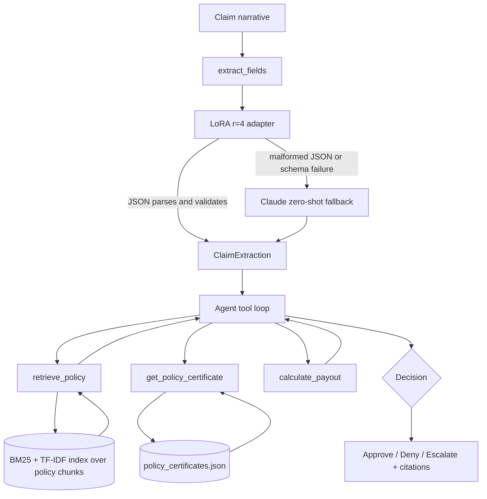

# Insurance Claims Agent

An agent that triages Australian home insurance claims: it extracts structured fields from a raw claim narrative, checks coverage against real insurer policy documents, calculates a payout from verified certificate data, and decides to approve, deny, or escalate, always citing the policy pages behind the decision. Built to compare a fine-tuned local model against a zero-shot API baseline on cost, accuracy, and reliability, not just accuracy alone.

## Results

**Extraction (synthetic test set, n=54, per-field score blending exact match, 5% amount tolerance, and token-F1, see [Extraction metric](#extraction-metric))**

| | Zero-shot Claude | LoRA r=4 | LoRA r=8 | LoRA r=16 |
|---|---|---|---|---|
| Overall score | 0.930 | 0.822 | 0.822 | 0.823 |
| 95% CI (bootstrap) | [0.914, 0.945] | [0.767, 0.863] | [0.769, 0.863] | [0.770, 0.866] |
| Parse failures | 0/54 | 2/54 | 2/54 | 2/54 |

The three LoRA ranks are statistically indistinguishable from each other. Zero-shot's advantage over all three is real (its confidence interval does not overlap any of theirs). That rules out adapter capacity as the bottleneck: giving the local model more trainable parameters didn't close the gap, so the production choice comes down to cost, not accuracy (see [Why r=4](#why-r4-despite-a-lower-score)). The gap is uneven across fields, not one uniform drop: `date_of_loss` and `policy_number` are within 0.04 of zero-shot, `estimated_amount` within 0.07, but `claim_type` (0.13), `damaged_item` (0.13), and especially `cause` (0.25) lag further behind. The fields the payout calculation actually depends on (the date, the amount, the policy number used to look up the certificate) are the fields LoRA is closest to matching; the fields it's weakest on are the free-text description of what happened, which is exactly the failure mode the Claude fallback exists to catch.

**Agent cost and latency (20-claim batch, full pipeline: extraction, retrieval, payout calculation, decision)**

| | Mean | p95 |
|---|---|---|
| Latency per claim | 17.55s | 27.73s |

Mean cost per claim: $0.0316. Total cost for the 20-claim run: $0.6323. Measured with real per-call token and latency instrumentation ([code/eval/instrumentation.py](code/eval/instrumentation.py)), not estimated.

This is the cost of the full agent, not a single model call: extraction, one or more `retrieve_policy` calls (each of which makes its own Claude call to generate a grounded answer), and the reasoning turns in between. At $0.0316 per claim, 10,000 claims a month would cost roughly $316 (a simple multiplication of the measured mean, not a separately measured figure), most of it coming from the number of tool-calling turns a claim takes rather than from the underlying model's per-token price.

**Retrieval quality (hit-rate@5 and MRR@5, n=8)**

| | Value |
|---|---|
| Hit-rate@5 | 1.000 (8/8) |
| MRR@5 | 0.613 |

Hit-rate@5 of 1.000 means the correct policy chunk was somewhere in the top 5 results for every one of the 8 questions. MRR@5 of 0.613 means it usually wasn't ranked first: an MRR of 1.0 would mean every correct chunk was the top result, and 0.613 corresponds to several questions where the right chunk placed 4th or 5th rather than 1st. In practice this means the generation step, which reads all 5 retrieved chunks rather than just the top one, is doing real work to find the right answer among plausible-looking distractors, not just passing through whatever ranked first.

This only covers 8 hand-written questions against the original 5 insurers (AAMI, Allianz, NRMA, RAA, RealInsurance). The corpus has since grown to 13 insurers and no ground truth exists yet for the other 8, so this number says nothing about retrieval quality on most of the current corpus. See [Limitations](#limitations-and-next-steps).

## Architecture



- **Retrieval** ([code/rag/](code/rag/)): hybrid BM25 and TF-IDF search with reciprocal rank fusion over policy chunks, filtered by insurer and product when named. Grounded answer generation with page-level citations lives in [code/rag/generate.py](code/rag/generate.py).
- **Extraction** ([code/extract/extract_fields.py](code/extract/extract_fields.py)): tries the LoRA r=4 adapter first ([code/extract/lora_infer.py](code/extract/lora_infer.py)). If the output fails to parse as JSON or fails Pydantic validation, falls back to a zero-shot Claude call ([code/extract/zero_shot.py](code/extract/zero_shot.py)). The schema both share is [code/extract/schema.py](code/extract/schema.py).
- **Agent loop** ([code/agent/loop.py](code/agent/loop.py)): a tool-calling loop with a capped number of turns and a named escalation policy. Tools are defined in [code/agent/tools.py](code/agent/tools.py): `extract_fields`, `retrieve_policy`, `get_policy_certificate`, `calculate_payout`, `escalate_to_human`.
- **Payout calculation**: `calculate_payout` only accepts excess and coverage-limit figures that came from `get_policy_certificate`, a lookup against [data/claims/policy_certificates.json](data/claims/policy_certificates.json). There is no code path where the model can supply an invented excess or limit into the formula.
- **Batch runner** ([code/agent/run_batch.py](code/agent/run_batch.py)): runs a JSONL file of claims through the loop, writes one decision log per claim to `outputs/decisions/` and a summary CSV.

## Key design decisions

### Why LoRA first despite a lower score

Zero-shot Claude scores higher (0.930 vs. 0.822), but the LoRA adapter has zero marginal cost per call once trained and only fails to produce valid JSON on 2 of 54 test examples. The Claude fallback exists specifically to catch that failure mode, so the common case is free and the rare failure case still gets Claude's higher accuracy. See [outputs/phase2_findings.md](outputs/phase2_findings.md).

### Why r=4 despite a lower score

An earlier run on a smaller training set (150 examples) found r=4 clearly outperforming r=8 and r=16. After the training set grew to 207 examples, that result did not hold: all three ranks converged to statistically indistinguishable scores. r=4 is still used in production, not because it wins, but because it is the cheapest of three tied options (fewest trainable parameters, fastest to train). See [extract_fields.py](code/extract/extract_fields.py).

### Why payouts only use tool-retrieved certificate data

Excess and coverage-limit figures are policyholder-specific and never appear in PDS or KFS text, only on an individual's certificate of insurance (confirmed directly in AAMI's PDS). Before `policy_certificates.json` existed, the agent correctly refused to guess these numbers and escalated 19 of 20 batch claims. Adding a certificate lookup tool, rather than letting the model estimate a plausible-looking number, is what produces a real decision spread instead of near-universal escalation.

### Extraction metric

The per-field score in the results table is not plain accuracy. It blends three scoring rules by field type ([code/extract/eval.py](code/extract/eval.py)):
- Exact match for `claim_type`, `date_of_loss`, `policy_number`.
- 5% relative tolerance for `estimated_amount`.
- Token-set F1 for the two free-text fields, `cause` and `damaged_item`.

The six field scores are averaged into one number per example. A prediction that fails to parse or fails schema validation scores 0 on every field.

## Example decision

Input narrative (from `data/claims/batch20.jsonl`, claim-003):

> On 3 February 2023 heavy rain caused the creek behind our property to overflow and water came into our home, ruining the carpets in the living room and soaking the bottom of the plasterboard walls. It happened really fast, within about an hour the water was ankle deep inside. We've had to rip up the carpet already because it started smelling. I think it'll cost around $9,000 to fix the flooring and walls.

Tool calls made by the agent, in order:
1. `extract_fields` on the narrative text.
2. `retrieve_policy` (`"Is flood or creek overflow water damage covered under home insurance?"`, insurer: RAA).
3. `get_policy_certificate` (insurer: RAA) → excess $500, coverage limit $45,000.
4. `calculate_payout` (claim_amount: 9000, excess: 500, coverage_limit: 45000) → $8,500.

Decision (`outputs/decisions/claim-003.json`), quoted exactly as generated:

> DECISION: approve
>
> Reasoning: The claim involves flood damage caused by a creek overflowing due to heavy rain, which flows into normally dry land — this matches RAA's policy definition of "Flood" under Insured Event 12 (RAA Contents PDS, page 50, 87). None of the listed exclusions (unbuilt structures, pools/spas, hydrostatic water, paint-only damage, unsealed paths, etc.) apply to this claim, since the damage is to living room carpet and plasterboard walls, legitimate structural/contents damage from flood water ingress.
>
> Policy certificate for RAA: excess = $500, coverage limit = $45,000. Claimed amount = $9,000, which is well within the coverage limit.
>
> Payout calculation: $9,000 − $500 excess = **$8,500 approved payout**.
>
> Citations:
> - RAA Contents PDS, page 50 (Insured Event 12, Flood coverage)
> - RAA Contents PDS, page 87 (Definition of Flood, including creek overflow)
> - RAA Contents PDS, page 88 (Actions of the Sea clarification, not applicable here)


## Limitations and next steps

- **The extraction test set is synthetic (n=54).** Both the training and test narratives were generated by Claude and, for the zero-shot comparison, partly graded by Claude. A separate real-world set of 11 claims, sourced from published AFCA (Australian Financial Complaints Authority) determinations, exists in `data/claims/afca_test.jsonl` and shows the "zero-shot beats LoRA" gap does not clearly hold at that sample size. Next step: grow that set past 11 before treating the synthetic result as production-representative.
- **Retrieval ground truth only covers 5 of 13 insurers.** The corpus grew from 18 to 44 documents this project, but the hand-verified hit-rate/MRR ground truth was never extended to the 8 newer insurers. Next step: write ground truth questions for the new insurers the same way the original 8 were built, by hand-checking citations against the source PDF.
- **Citations are document and page level, not quote level.** A citation says which PDS and page a claim came from, not the exact sentence. Only one citation has been manually verified against the source PDF text; there is no systematic audit across the corpus. Next step: sample a batch of citations across many claims and check each against the source text, then report a groundedness rate.
- **A known retrieval gap exists for insurers with combined Building and Contents documents** (NRMA, Suncorp, Allianz). Filtering by `product="Contents"` for these insurers misses their combined PDS, which is tagged `product="Home"`. Next step: either multi-label combined documents or fall back to an unfiltered search when a strict product filter returns thin results.
- **Agent decisions are not deterministic between runs.** Checked directly: `anthropic==1.3.0`'s `Messages.create()` signature has no `temperature`, `top_p`, or `seed` parameter for the `claude-sonnet-5` model this project calls. Identical inputs can produce different decisions on separate runs, and there is currently no sampling-control parameter available to fix that.
- **Prompt-injection and fairness red-teaming are stubbed, not implemented** (`code/redteam/injection_suite.py`, `code/redteam/fairness_pairs.py`). Function signatures and TODOs exist; no test cases or logic have been written yet.
- **The free-text field gap (`cause`, `damaged_item`) between zero-shot and LoRA is unexplained.** It is not a training-data-volume problem (more data did not close it) and not a model-capacity problem (higher LoRA rank did not close it either). The actual cause has not been identified.

## Project status by phase

| Phase | Status |
|---|---|
| 1. Retrieval over real policy documents | Done |
| 2. Structured extraction, LoRA fine-tuning ablation | Done, with the limitations above |
| 3. Agent orchestration (tools, escalation policy, decision logs) | Done |
| 4. Cost/latency instrumentation | Done |
| 4. Prompt-injection and fairness red-teaming | Stubbed only, not implemented |
| 5. Golden-set evaluation, naive baseline comparison | Not started |
| 6. Vector DB, multi-agent split, web UI | Not started |

## Setup and running it

### Requirements

- Python 3.14.
- An `ANTHROPIC_API_KEY` (required, used by every zero-shot and agent call).
- Optionally `ANTHROPIC_WORKSPACE_ID`, if your API key is workspace-scoped.
- Optionally `LLM_MODEL` to override the default model string.

Put these in a `.env` file at the repo root. Never commit real key values.

Install dependencies:

```
pip install -r requirements.txt
```

### Running the pipeline

All commands below are run from the `code/` directory.

Rebuild the policy document corpus from scratch (see [Data](#data)):
```
python -m ingest.discover_sources
python -m ingest.download
python -m ingest.extract_text
python -m rag.build_index
```

Ask a coverage question:
```
python cli.py "is storm damage to my roof covered?" --insurer AAMI --debug
```

Run structured extraction on a claim narrative:
```
python -c "from extract.extract_fields import extract_fields; print(extract_fields('your claim text here'))"
```

Run the agent on a batch of claims:
```
python -m agent.run_batch ../data/claims/batch20.jsonl
```

Evaluation scripts:
```
python -m extract.zero_shot --dataset test        # zero-shot baseline
python -m extract.lora_infer --rank 4 --dataset test   # LoRA adapter eval
python -m eval.bootstrap_ci ../outputs/zero_shot_results.json ../outputs/lora_r4_results.json
python -m eval.check_leakage                       # train/val/test split leakage check
python -m eval.hit_rate                            # retrieval hit-rate@5 / MRR@5
```

### Data

`data/raw_pdfs/`, `data/extracted/`, and `data/chunks.jsonl` are not committed to this repository. `data/manifest.json` and `data/sources.json` are, since they're just corpus metadata, not the documents themselves. Rebuild the actual corpus locally with the ingest commands above; every source is a public insurer disclosure page.

The ingest pipeline downloads from insurer disclosure pages whose URLs may change without notice. It was last verified end to end on 2026-09-20.

## Repo structure

```
code/
  ingest/      discover, download, and extract text from insurer PDS/KFS PDFs
  rag/         chunking, hybrid BM25+TF-IDF indexing, grounded generation with citations
  extract/     schema, synthetic data generation, zero-shot baseline, LoRA training and inference
  agent/       tool definitions, decision loop, batch runner
  eval/        bootstrap confidence intervals, leakage check, retrieval hit-rate, cost/latency instrumentation
  redteam/     prompt-injection and fairness test scaffolding (not yet implemented)
data/
  raw_pdfs/    source insurer PDF documents
  extracted/   per-page extracted text
  claims/      synthetic and real-world (AFCA) claim narratives, splits, policy certificate data
  chunks.jsonl, manifest.json, sources.json   retrieval index inputs and corpus metadata
outputs/
  decisions/           per-claim agent decision logs
  phase2_findings.md, phase3_findings.md, phase4_report.md   write-ups and measured results
  *_results.json       per-example predictions and scores for each eval run
PROJECT_LOG.md   a running, dated log of what was built, why, and what broke, phase by phase
```
